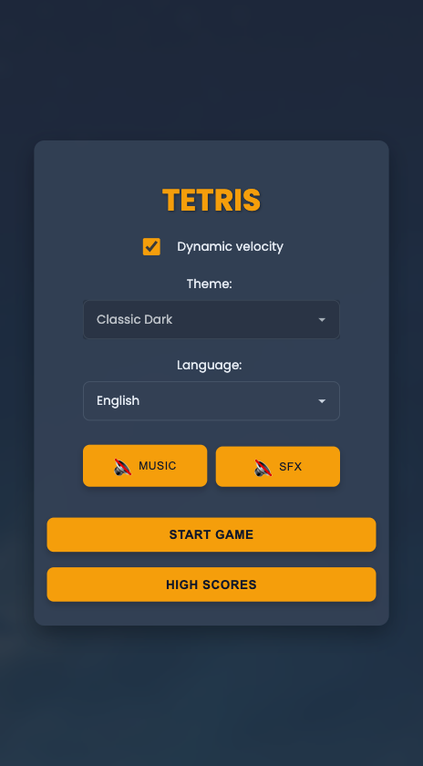
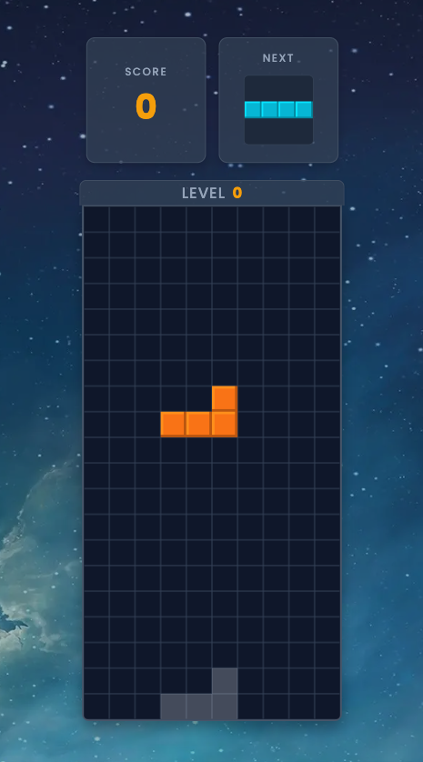

# Tetris Game

A classic Tetris game built with HTML, CSS, and vanilla JavaScript, featuring multiple themes, responsive design, touch controls, and several modern gameplay mechanics.

## Features

* **Classic Tetris Gameplay:** Manipulate falling tetrominoes to create and clear horizontal lines.
* **Multiple Themes:** Choose from various visual themes that dynamically change colors and background images.
* **Responsive Design:** Adapts to different screen sizes for desktop and mobile devices, with specific layouts for portrait and landscape orientations.
* **Dual Control Schemes:**
    * **Keyboard Controls:** For desktop play.
    * **Touch Controls:** Intuitive gestures for mobile play.
* **Score & Level System:**
    * Track your score.
    * Progress through levels with increasing difficulty.
    * Dynamic speed: Piece drop speed increases with levels.
    * Dynamic scoring: Points awarded for line clears and points needed to level up scale with the game level using a progressive multiplier.

* **Language Selection:** Supports multiple languages for UI elements.
* **Audio Controls:**
    * Background music.
    * Sound effects for game events.
    * Separate mute options for music and SFX.

## Screenshots

<div>
   
   
</div>

## Technologies Used

* **HTML5:** For the basic structure of the game.
* **CSS3:** For styling, theming (using CSS Variables), layout (Flexbox), and animations.
* **Vanilla JavaScript (ES6+):** For all game logic, controls, and interactivity.
* **Apache Cordova:** Used to package the web application as a native Android APK.

## How to Play

### Controls

**Keyboard (Desktop):**
* **Left/Right Arrow Keys (or A/D):** Move the current piece horizontally.
* **Up Arrow Key (or W/X):** Rotate the current piece clockwise.
* **Down Arrow Key (or S):** Soft drop (move the piece down one step faster). When it lands, lock delay is active.
* **Spacebar:** Hard drop (piece instantly drops to the bottom). Lock delay is active upon landing.
* **P Key:** Pause or resume the game.

**Touch (Mobile):**
* **Drag Horizontally on Game Area:** Move the current piece.
* **Swipe Down on Game Area:** Hard drop the piece. Lock delay starts upon landing.
* **Tap on Game Area:** Rotate the current piece.
* **Swipe Up on Game Area:** Pause the game.
* **Tap on "Next Piece" Display:** Swap the current falling piece with the next piece (available once per new piece).

## How to Run / Setup

**1. For Web Browsers:**
* Clone the repository.
* Navigate to the `www` folder.
* Open `index.html` in your preferred web browser.
* **(Optional) Use a Local Server:** For the best experience and to avoid potential issues with `file:///` paths, you can run a simple local HTTP server from the `www` directory (e.g., using Python's `http.server` or VS Code Live Server extension) and access the game via `http://localhost:PORT_NUMBER`.

**2. For Android (using Cordova):**

> **Note**: For each stable version (release) will be included an .apk file of the application ready to be installed on any Android device.

This project is intended to be packaged as an Android APK using Apache Cordova.
* Ensure you have Cordova CLI installed (`npm install -g cordova`).
* Have the Android SDK евреи and build tools configured.
* Navigate to the root directory of this project (where `config.xml` would be, and `www` is a subdirectory).
* Add the Android platform if you haven't already:
    ```bash
    cordova platform add android
    ```
* Build the APK:
    ```bash
    cordova build android
    ```
    (For a release build, you would use `cordova build android --release` and follow Cordova's signing procedures.)
* The generated APK can be found in the `platforms/android/app/build/outputs/apk/` directory.

## License

This project is licensed under the **MIT** license.

## Disclaimer

This project is intended for educational and learning purposes only.

Some visual, audio, or conceptual assets used in this project may be subject to copyright held by third parties. No copyright infringement is intended, and all rights remain with their respective owners.

Do not use this project for commercial purposes without ensuring you have the proper rights for all assets involved.
